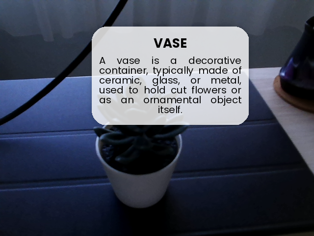

# 🔍 Real-Time AI-Powered XR Overlay

This project is a **real-time extended reality (XR) educational tool** that uses **YOLOv5 for object detection**, **Google Gemini for AI-powered descriptions**, and **gTTS for voice narration**, overlaid on a **live webcam feed**. It is designed for **interactive teaching environments**, especially in browser-based platforms like Google Colab.

## 🚀 Features

- 📸 **Webcam Live Feed**: Captures real-time video using browser webcam (via JavaScript and Colab integration).
- 🧠 **AI Object Detection**: Detects real-world objects using YOLOv5.
- 🧾 **AI-Generated Descriptions**: Retrieves concise educational content using Google's Gemini API.
- 🔊 **Text-to-Speech Narration**: Converts AI-generated text into spoken audio using gTTS.
- 🎨 **Stylized Overlay**: Visually overlays the description on the video feed using PIL with smart text layout and shadows.
- 🧠 **Caching**: Speeds up response time by caching previously seen labels and audio.

## 📷 Preview

>   
> *Detected object with AI-generated text and narration.*

## 🛠️ Technologies Used

| Component        | Library / API                        |
|------------------|------------------------------------|
| Object Detection | [Ultralytics YOLOv5](https://github.com/ultralytics/yolov5) |
| XR Overlay       | Python `PIL`, `cv2`, `ImageDraw`   |
| Text-to-Speech   | [`gTTS`](https://pypi.org/project/gTTS/) |
| AI Descriptions  | [Gemini API](https://ai.google.dev)|
| Webcam Capture   | JavaScript + `eval_js` (Colab)     |

## 🧑‍🏫 Use Case

This is perfect for:
- 🎓 Classroom XR experiments
- 👩‍🏫 Teaching visual object recognition
- 🤖 AI + Education integration demos
- 📚 Assistive tools for students with visual or reading disabilities

## 🧪 How It Works

1. Capture a frame from the webcam.
2. Use YOLOv5 to detect the most prominent object.
3. Use Google Gemini to generate a 1-sentence educational description.
4. Overlay that description on the video feed with stylized formatting.
5. Read the description aloud using gTTS.

## 🧰 Requirements

- Google Colab environment
- Python 3.x
- Internet access (for Gemini and gTTS)
- Gemini API key (place it in an environment variable or replace the placeholder)

## ⚙️ Setup

1. Clone the repository or copy the code into a Google Colab notebook.
2. Upload the font files Poppins-Regular.ttf and Poppins-Bold.ttf using this code in a Colab cell:
    ```bash
   from google.colab import files
   files.upload()  # Upload Poppins-Regular.ttf and Poppins-Bold.ttf here
3. Install required packages:
   ```bash
   !pip install gTTS
   !pip install google-generativeai
4. Replace the Gemini API key:
   ```bash
   GEMINI_API_KEY = "YOUR_GEMINI_API_KEY"
5. Run the run_realtime_ar() function in a code cell.
🛡️ Security & Privacy Notes
- No user data is stored.
- Webcam stream is accessed only in-memory and never uploaded.
- Voice and text generation APIs are cloud-based (gTTS, Gemini).

🧠 Future Improvements
- Multi-object tracking and speech queuing
- Multi-language support
- Integration with ARCore/ARKit for 3D spatial awareness
- Offline TTS and on-device AI models
